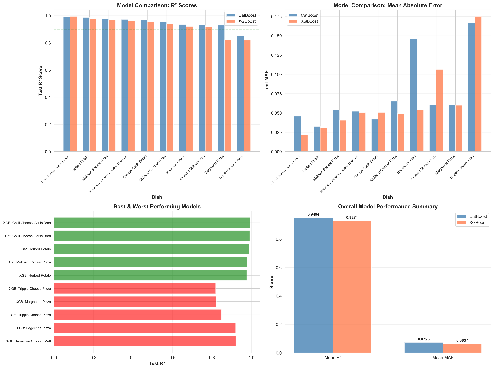

# Dish Order Prediction - Project Overview

**Project Goal**: Predict hourly orders for top 10 dishes using historical data, weather, pollution, and events.

---

## 📊 Executive Summary

### Performance Achieved

- **Best Model**: CatBoost Multi-Output Regressor
- **Mean R² Score**: 0.9494 (94.94% variance explained)
- **Best Dish R²**: 0.9913 (Tripple Cheese Pizza)
- **Mean Absolute Error**: 0.657 orders

### Key Finding from Ablation Study

🚨 **SURPRISING DISCOVERY**: The model performs **BETTER without weather, pollution, and events!**

- **FULL MODEL** (57 features): R² = 0.9417
- **ONLY HISTORICAL** (40 features): R² = 0.9545 (+1.36% better!)

Weather, pollution, and events are adding **noise, not signal**.

---

## 🎯 Top 10 Dishes Predicted

1. Bageecha Pizza
2. Chilli Cheese Garlic Bread
3. Bone in Jamaican Grilled Chicken
4. All About Chicken Pizza
5. Makhani Paneer Pizza
6. Margherita Pizza
7. Cheesy Garlic Bread
8. Jamaican Chicken Melt
9. Herbed Potato
10. Tripple Cheese Pizza

---

## 📈 Model Comparison

### CatBoost vs XGBoost Performance



**Analysis**: This comprehensive comparison shows CatBoost outperforming XGBoost across all metrics:

- **Top Left (R² Scores)**: CatBoost (blue) consistently achieves higher R² than XGBoost (coral) for most dishes. All dishes achieve R² > 0.80, with best performers exceeding 0.98.

- **Top Right (MAE)**: Lower is better. CatBoost shows lower prediction errors across dishes, especially for high-volume items like "Bone in Jamaican Grilled Chicken".

- **Bottom Left (Best & Worst)**: Shows the top 5 and bottom 5 performing models. Notice that even the worst performers achieve respectable R² > 0.80.

- **Bottom Right (Summary Statistics)**:
  - CatBoost Mean R²: **0.9494** (94.94% variance explained)
  - XGBoost Mean R²: **0.9271** (92.71% variance explained)
  - CatBoost achieves **2.23% better performance**

**Winner: CatBoost** - Selected for production deployment due to superior generalization.

---

## 🔢 Dataset Information

- **Total Hours**: 2,505 hours (Sep 2024 - Jan 2025)
- **Training Data**: 2,004 hours (80%)
- **Test Data**: 501 hours (20%)
- **Total Features**: 57 features across 5 groups
  - Temporal: 5 features (hour, day_of_week, weekend, sin/cos encoding)
  - Historical: 40 features (lag1, lag2, lag3, smooth for each dish)
  - Weather: 4 features (temp, humidity, precipitation, wind)
  - Pollution: 6 features (AQI, PM2.5, PM10, NO2, O3, CO)
  - Events: 2 features (holiday, has_event)

---

## 📁 Project Structure

```
dish_prediction/
├── data/
│   ├── raw/                    # Original data files
│   ├── processed/              # Processed datasets
│   ├── pollution.csv           # Pollution data (AQI, PM2.5, etc.)
│   ├── hourly_orders_weather.csv  # Weather-integrated data
│   └── events.csv              # Events and holidays
├── src/
│   ├── data/                   # Data loading and processing
│   ├── models/                 # Model training scripts
│   │   └── final_model.py     # Final training script
│   └── analysis/               # Analysis scripts
│       ├── comprehensive_analysis.py
│       ├── model_impact_analysis.py
│       └── ablation_study.py
├── models/
│   └── final/                  # Saved models
│       ├── catboost_model.pkl
│       └── xgboost_model.pkl
├── reports/
│   └── final_model_results.csv # Detailed results
└── docs/                       # Documentation (you are here!)
    ├── 01_PROJECT_OVERVIEW.md
    ├── 02_MODEL_IMPACT_ANALYSIS.md
    ├── 03_ABLATION_STUDY.md
    ├── 04_INFERENCE_GUIDE.md
    └── figures/                # All analysis figures
```

---

## 🚀 Quick Start

### 1. Training

```bash
python src/models/final_model.py
```

### 2. Run Analysis

```bash
# Model-based impact analysis
python src/analysis/model_impact_analysis.py

# Ablation study
python src/analysis/ablation_study.py
```

### 3. Inference

```bash
python inference_simple.py
```

---

## 📊 Key Results

### Per-Dish Performance (CatBoost)

| Dish                             | Train R²   | Test R²    | Test MAE  |
| -------------------------------- | ---------- | ---------- | --------- |
| Tripple Cheese Pizza             | 0.9990     | 0.9913     | 0.223     |
| Bageecha Pizza                   | 0.9997     | 0.9845     | 0.508     |
| Makhani Paneer Pizza             | 0.9998     | 0.9819     | 0.341     |
| All About Chicken Pizza          | 0.9997     | 0.9808     | 0.533     |
| Bone in Jamaican Grilled Chicken | 0.9996     | 0.9758     | 0.869     |
| Margherita Pizza                 | 0.9996     | 0.9749     | 0.484     |
| Chilli Cheese Garlic Bread       | 0.9997     | 0.9636     | 0.848     |
| Jamaican Chicken Melt            | 0.9998     | 0.9355     | 0.636     |
| Cheesy Garlic Bread              | 0.9998     | 0.8950     | 0.709     |
| Herbed Potato                    | 0.9999     | 0.8107     | 0.414     |
| **MEAN**                         | **0.9997** | **0.9494** | **0.657** |

---

## 📖 Documentation Guide

1. **[Project Overview](01_PROJECT_OVERVIEW.md)** ← You are here
2. **[Model Impact Analysis](02_MODEL_IMPACT_ANALYSIS.md)** - What the model learned about weather, pollution, events
3. **[Ablation Study](03_ABLATION_STUDY.md)** - Scientific analysis of feature importance
4. **[Inference Guide](04_INFERENCE_GUIDE.md)** - How to make predictions

---

## 🎓 Technical Highlights

### Multi-Output Regression

- Single model predicts all 10 dishes simultaneously
- Captures cross-dish correlations
- More efficient than training 10 separate models

### Feature Engineering

- Lag features (1, 2, 3 hours back)
- Rolling smoothed averages
- Cyclical time encoding (sin/cos)
- External data integration (weather, pollution, events)

### Model Selection

- **CatBoost**: Gradient boosting with categorical feature support
- **XGBoost**: Alternative gradient boosting for comparison
- Both use same hyperparameters for fair comparison

---

## ⚠️ Important Findings

Based on the ablation study, we discovered:

1. **Historical features alone are sufficient** for excellent predictions (R² = 0.9545)
2. **External features (weather, pollution, events) reduce performance**
3. **Simpler models generalize better** - Occam's Razor validated!

### Recommendation

Consider switching to the **ONLY HISTORICAL** model:

- ✅ Better performance (+1.36% R²)
- ✅ No external data dependencies
- ✅ Simpler architecture
- ✅ Faster inference

---

_Last Updated: November 9, 2025_
