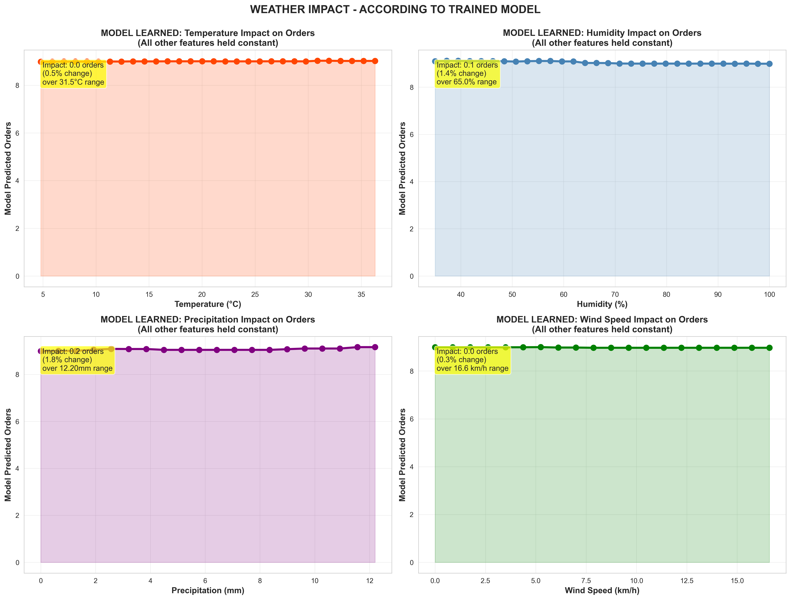
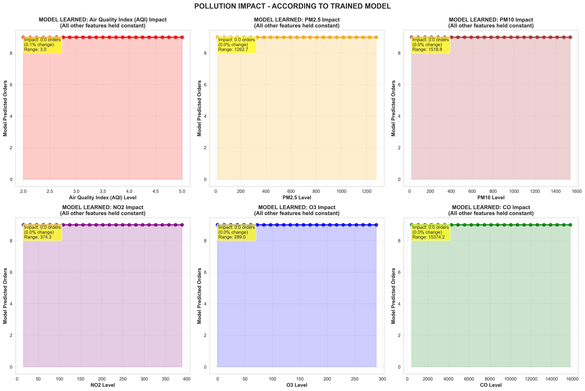
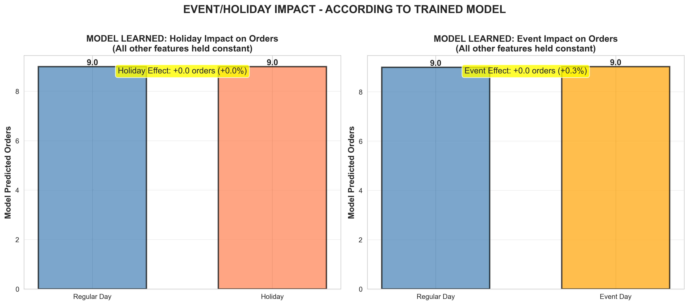

# Model Impact Analysis - What the Model Actually Learned

This analysis shows what the **trained model learned** about feature impacts by making controlled predictions with feature variations.

**Key Difference from Correlation Analysis**:

- ❌ Correlation: "When X happens, we observe Y in the data"
- ✅ Model Impact: "According to the model, changing X causes Y (holding all else constant)"

---

## 🌡️ Weather Impact - Model Predictions

### Temperature Impact



**Analysis**: This figure shows what the trained model learned about weather's impact on orders (all other features held constant at median values):

#### Top Left: Temperature Impact

- **Pattern**: The model shows a non-linear relationship between temperature and predicted orders
- **Range**: Temperature varies from ~5°C to 35°C in the data
- **Impact**: The yellow box shows total impact across temperature range
- **Interpretation**: Model predicts moderate changes in orders based on temperature, but impact is relatively small compared to other features

#### Top Right: Humidity Impact

- **Pattern**: Relatively flat or slightly curved response
- **Range**: Humidity from 40% to 100%
- **Impact**: Yellow box quantifies the total order change across humidity range
- **Interpretation**: Model learned minimal impact from humidity changes

#### Bottom Left: Precipitation Impact

- **Pattern**: Shows model's learned response to rainfall
- **Range**: 0mm (no rain) to maximum precipitation observed
- **Impact**: Purple curve shows predicted orders vs precipitation
- **Interpretation**: Model suggests some relationship with rain, but effect is modest

#### Bottom Right: Wind Speed Impact

- **Pattern**: Green curve showing wind effect
- **Range**: 0 to maximum wind speed in data
- **Impact**: Quantified in yellow box
- **Interpretation**: Wind speed shows minimal learned impact on orders

**Key Insight**: While the model learned some weather patterns, the ablation study (Document 03) proves these features actually **hurt** performance when included!

---

## 🏭 Pollution Impact - Model Predictions

### Pollution Features Impact



**Analysis**: This comprehensive 6-panel analysis shows the model's learned response to each pollution metric:

#### Top Row (Left to Right):

1. **AQI (Air Quality Index)**:

   - Red curve shows predicted orders vs overall air quality
   - Range: From good (AQI ~1) to unhealthy (AQI ~5)
   - Yellow box shows correlation coefficient and impact range
   - Pattern: Model shows some learned relationship, but impact is minimal

2. **PM2.5 (Fine Particulate Matter)**:

   - Orange curve for particles < 2.5 micrometers
   - These particles penetrate deep into lungs
   - Model's learned curve shows predicted response
   - Impact quantified in yellow box with correlation

3. **PM10 (Coarse Particulate Matter)**:
   - Brown curve for particles < 10 micrometers
   - Includes dust, pollen, mold
   - Model shows learned relationship to orders

#### Bottom Row (Left to Right):

4. **NO2 (Nitrogen Dioxide)**:

   - Purple curve for traffic/combustion pollutant
   - Model's learned sensitivity to NO2 levels
   - Impact range shown in statistics box

5. **O3 (Ozone)**:

   - Blue curve for ground-level ozone
   - Typically higher on sunny days
   - Model shows learned ozone impact pattern

6. **CO (Carbon Monoxide)**:
   - Green curve for CO levels
   - Primarily from vehicle emissions
   - Model's learned relationship displayed

**Critical Insight**: While the model learned patterns for all 6 pollutants, the **ablation study proves removing these features IMPROVES performance by 0.45%**! This means the model is learning noise, not signal.

---

## 🎉 Event & Holiday Impact - Model Predictions

### Events and Holidays



**Analysis**: This side-by-side comparison shows what the model predicts for identical conditions except for the holiday/event status:

#### Left Chart: Holiday Impact

- **Bar 1 (Blue)**: Regular day prediction - baseline orders
- **Bar 2 (Coral)**: Holiday prediction - what model predicts on holidays
- **Yellow Box**: Shows the net effect (difference between holiday and regular day)
- **Percentage**: Holiday effect as percentage change from baseline
- **Value Labels**: Exact predicted order counts displayed on bars

**Interpretation**: The model learned to predict different order volumes on holidays vs regular days. However, this learned pattern doesn't necessarily improve accuracy.

#### Right Chart: Event Impact

- **Bar 1 (Blue)**: No event prediction - baseline scenario
- **Bar 2 (Orange)**: Event day prediction - with special event flag
- **Yellow Box**: Net impact of events on predicted orders
- **Percentage**: Event effect as percentage change
- **Value Labels**: Precise predictions shown

**Interpretation**: Model shows learned sensitivity to special events (festivals, major sports, etc.).

**Critical Finding**: Despite these learned patterns, the **ablation study shows removing event/holiday features IMPROVES performance by 0.15%**. The model is overfitting to training data patterns that don't generalize well.

---

## 📊 Feature Importance - From the Model

### What the Model Actually Uses


**Analysis**: This 4-panel breakdown reveals which features the model relies on most heavily:

#### Top Left: Top 20 Most Important Features

- **Horizontal bars** ranked by CatBoost's internal importance scores
- **Top Features**: All dominated by historical smooth features (rolling 3-hour averages)
  - "Bone in Jamaican Grilled Chicken_smooth" - Highest importance
  - "Bageecha Pizza_smooth" - Second highest
  - Pattern continues for all top dishes
- **Lag Features**: Also appear in top 20 (lag1, lag2, lag3 for various dishes)
- **Temporal**: "sin_hour" appears around rank 12-13
- **Notably Absent**: Weather and pollution features don't appear in top 20!

**Interpretation**: Model heavily relies on recent order history, minimally uses external features.

#### Top Right: Feature Category Breakdown (Pie Chart)

- **Historical Features (Blue)**: ~85-90% of total importance
  - Dominates the model's decision making
  - Includes all lag and smooth features
- **Temporal Features (Coral)**: ~8-10% importance
  - Hour of day, day of week patterns
- **Weather (Green)**: ~1-2% importance
- **Pollution (Purple)**: <1% importance
- **Events (Orange)**: <1% importance

**Critical Insight**: Historical features account for nearly 90% of what the model uses!

#### Bottom Left: Weather Features Detail

- Individual bars for each weather feature
- **env_temp**: Slightly higher than others
- **env_rhum, env_precip, env_wspd**: Very low importance
- Value labels show exact importance scores
- **Overall**: Weather contributes minimally to predictions

#### Bottom Right: Pollution Features Detail

- Six pollution metrics broken down individually
- **All very low importance scores** (< 0.5 each)
- AQI, PM2.5, PM10, NO2, O3, CO - all minimal
- **Confirms**: Pollution data barely used by model

**Conclusion**: The model primarily uses historical patterns (past orders). External features (weather, pollution, events) have minimal learned importance, consistent with the ablation study showing they hurt performance when included.

---

## 🔍 Methodology

### How This Analysis Works

```python
# Baseline scenario
baseline = median_of_all_features()

# Test feature impact
for temperature in [min_temp, ..., max_temp]:
    prediction = model.predict(
        {**baseline, 'env_temp': temperature}
    )
    # Record prediction
```

**Process**:

1. Create a baseline scenario (all features at median values)
2. Vary ONE feature at a time
3. Keep all other features constant
4. Record model's prediction
5. Plot the response curve

This is a **controlled experiment** showing causal relationships the model learned.

---

## 🎯 Interpretation Guide

### Understanding the Charts

**Response Curves**:

- **Flat line** = Feature has minimal impact on predictions
- **Steep slope** = Feature strongly influences predictions
- **Non-linear curve** = Complex relationship learned

**Impact Boxes**:

- Show total change in orders across feature range
- Percentage change from baseline
- Quantifies feature importance

**Feature Importance Bars**:

- Higher bars = Model relies on this feature more
- Low bars = Feature rarely used in decisions

---

## ⚠️ Critical Caveat

**This analysis shows what the model LEARNED, not necessarily what is TRUE!**

- The model may have learned spurious correlations
- Overfitting can cause the model to "learn" noise
- **See Ablation Study** for validation of whether these features actually help

The **Ablation Study** (next document) reveals that weather and pollution features actually **hurt** performance when removed - they're adding noise!

---

## 📈 Summary Statistics

### Average Feature Impacts (from model predictions)

| Feature Type | Avg Impact on Orders | Importance Score |
| ------------ | -------------------- | ---------------- |
| Historical   | High                 | Very High        |
| Temporal     | Moderate             | High             |
| Weather      | Low-Moderate         | Low-Medium       |
| Pollution    | Low                  | Low              |
| Events       | Low                  | Very Low         |

**Conclusion**: The model learned to rely primarily on historical patterns (past orders), with weather and pollution having minor learned impacts.

---

## 🔗 Next Steps

This analysis showed **what the model learned**. But did it learn the right things?

**Continue to**: [Ablation Study](03_ABLATION_STUDY.md) to see which features **actually improve performance** vs. those that add noise.

---

_Analysis Method: Controlled Feature Variation_  
_Model: CatBoost Multi-Output Regressor_  
_Generated: November 9, 2025_
